# Context Agility Manager
The Context Agility Manager (CAM) in the PQ-REACT framework facilitates cryptographic agility by automatically selecting and configuring post-quantum and hybrid encryption algorithms tailored to the operational context. Leveraging principles from the PQC research community, CAM dynamically adjusts cryptographic configurations by analyzing real-time data from infrastructure assets and their associated security parameters. This context-aware mechanism takes into account various factors such as compliance with regulatory standards, the availability of cryptographic algorithms, security requirements, and resource constraints. Furthermore, CAM mitigates common issues related to cryptographic misconfigurations by automating the selection of optimal defaults, such as algorithm types, key sizes, and security levels. This ensures robust, adaptable security configurations are applied efficiently, as demonstrated in use cases like the Qujata testbed, where CAM enhances client-server communication security using post-quantum cryptographic methods.

The implementation of this repo currently enables users to create dashboards for monitoring the communication between a server and a client machine within the Qujata testbed. While CAM does not yet dynamically select the most suitable cryptographic configurations, it can loop through the available post-quantum, classical, and hybrid encryption algorithms provided by the Qujata framework. This allows users to visualize the performance and security impact of different algorithms in real-time. The integrated dashboards help users track system metrics, evaluate the effectiveness of each cryptographic approach, and better understand the operational environment, paving the way for future enhancements toward fully automated cryptographic agility.


## Recommended Setup

During the implementation of this repository, InfluxDB and Grafana instances were installed on two different virtual machines, while Telegraf and Qujata Server/Client instances were installed and configured on two separate physical machines (NUC).

## Requirements

This guide assumes the following prerequisites:

- Ubuntu 22.04 OS
- Git
- Nano (or any text editor of your choice)
- Node.js (which includes npm) for Client machine
- Docker Engine for Server machine

### Important Note

In the `metrics_dashboard.json` file, it is assumed that the username is `node-1`, the network interface is `enp86s0`, and the bucket name is `NUC_metrics`. If different, change these values to match your setup.

## Steps for Implementation

### Step 1: Install and Configure InfluxDB

**Update the System:**

```bash
sudo apt update && sudo apt upgrade
```

**Install InfluxDB:**

```bash
wget -q https://repos.influxdata.com/influxdb.key
echo '23a1c8836f0afc5ed24e0486339d7cc8f6790b83886c4c96995b88a061c5bb5d influxdb.key' | sha256sum -c && cat influxdb.key | gpg --dearmor | sudo tee /etc/apt/trusted.gpg.d/influxdb.gpg > /dev/null
curl -LO https://download.influxdata.com/influxdb/releases/influxdb2_2.7.6-1_amd64.deb
sudo dpkg -i influxdb2_2.7.6-1_amd64.deb
sudo apt update
sudo apt install influxdb2
sudo systemctl start influxdb
```

**Initial Configuration of InfluxDB:**

```bash
influx setup
```
You need to set up your initial username, password, organization name, the primary bucket name to store data, and retention period (in hours). Your details are stored in /home/username/.influxdbv2/configs

This setup can be done by launching the URL http://<serverIP>:8086/ in your browser. Once you have performed the initial setup, you can log in to the URL with the credentials created above.
You should be greeted with the following dashboard:

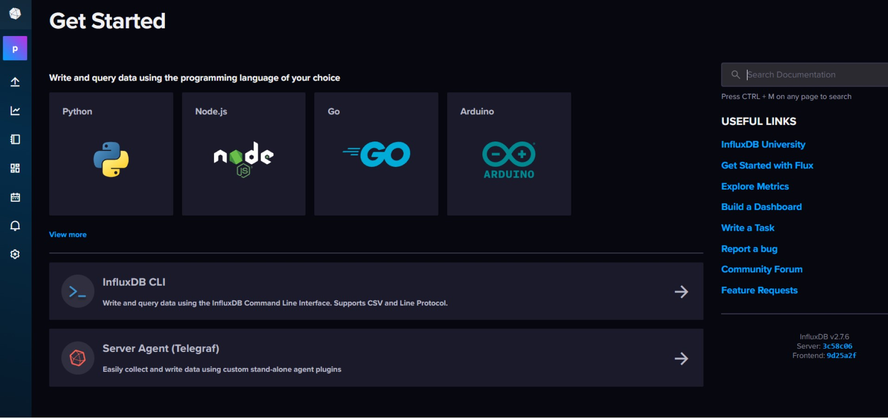

***Create a new data Bucket (if necessary)***
Initially during Influxdb configuration steps you’ve created a primary data bucket which may have no time limit for erasing old data (retention period). If such a limit is vital for your project’s
requirements (which in our case is!), or you either need a new bucket then you should create a new one and configure it. It is recommended to create a separate bucket for storing metrics for
each of your physical machines.

- On the “welcome” page of the UI (URL http://<serverIP>:8086/ in your browser), click the “Buckets” option to navigate to the corresponding page as shown below:

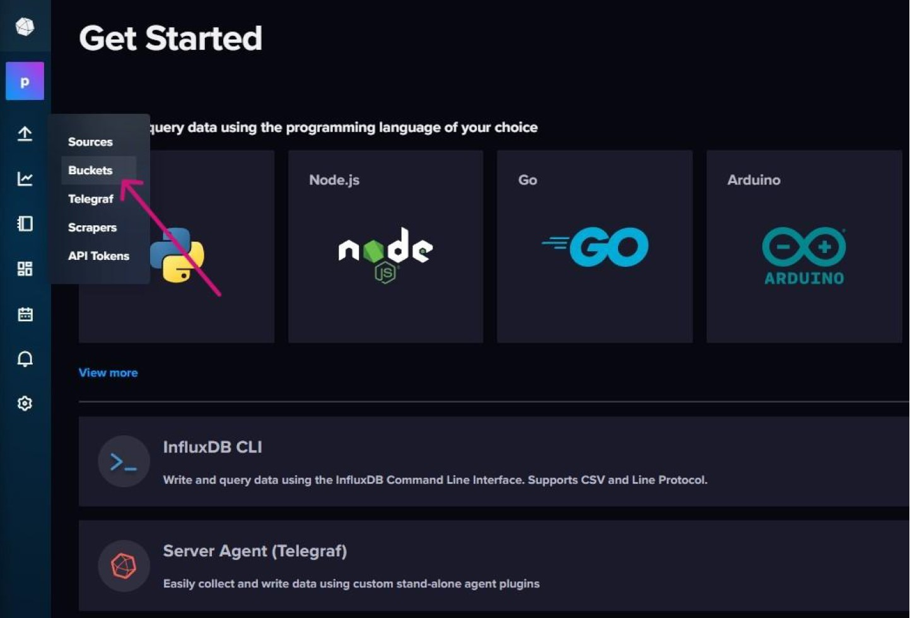

- Click on the “+ CREATE BUCKET” button on the top right of the UI.

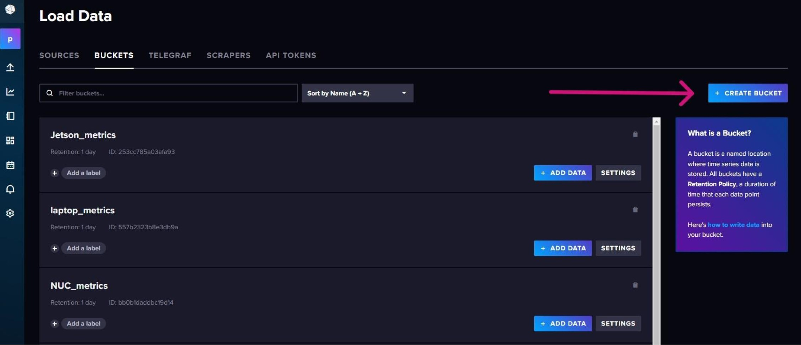

- Enter the name of your bucket and select the “OLDER THAN” option under the “Delete Data” label. Select the appropriate value for the deletion time limit of your data (e.g. 12 hours), then click “Create”

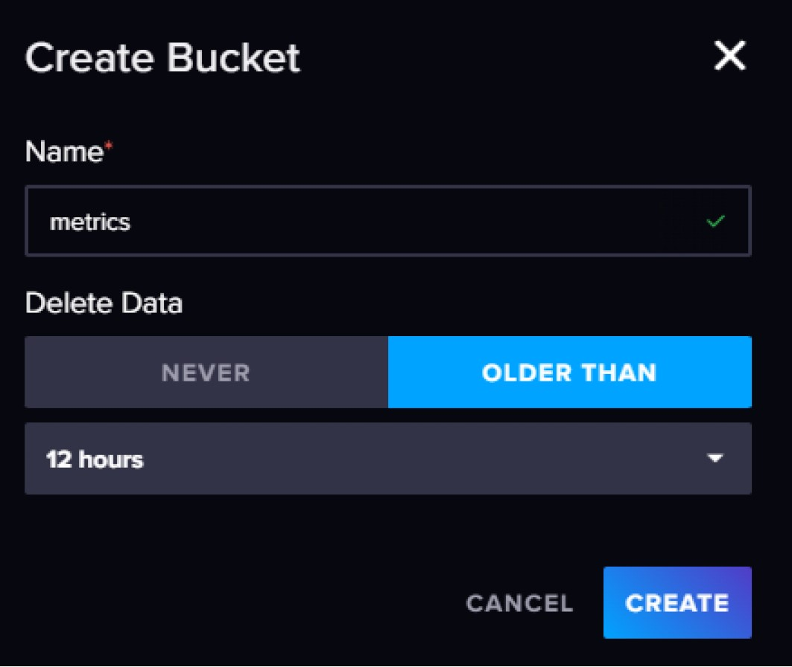

***InfluxDB Access Token***
The initial setup process creates a default token that has full read and write access to all the organizations in the database. You should save every token the moment you create one, as it is
shown only once, when it is generated. You can not recover it after you close the “You’ve successfully created an API Token” window. For security purposes you can create a new token which will
only connect to the organization and bucket you need to. If this is not the case you can save the default token (which provides full read/write access to your database), since it will be necessary for configuring telegraf later:

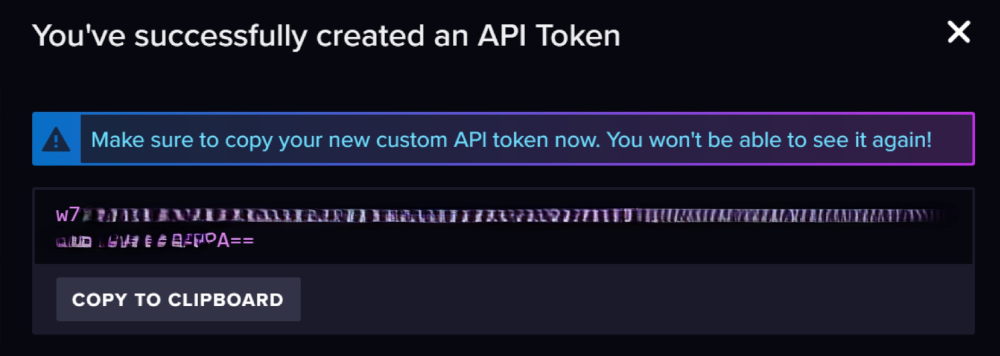

### Step 2: Install and Configure Telegraf on Both Server and Client Machines

**Create a Directory:**

```bash
mkdir metrics_retrieval && cd metrics_retrieval/
```

**Install Telegraf:**

```bash
sudo apt-get update
sudo apt install telegraf
```

**Edit the Telegraf Configuration:**

```bash
sudo nano /etc/telegraf/telegraf.conf
```

Modify the following sections:

**Data Collection Interval:**

```ini
[agent]
interval = "1s"
```

**InfluxDB Configuration:**
```ini
[[outputs.influxdb_v2]]
urls = ["http://<your-influxdb-host>:8086"]
token = "$INFLUX_TOKEN"
organization = "pqreact"
bucket = "metrics_1"
```

**Enable Intel PowerStat Plugin:**

```ini
[[inputs.intel_powerstat]]
cpu_metrics = ["cpu_frequency", "cpu_temperature", "cpu_busy_frequency"]
```
Once you are finished, save the file by pressing Ctrl + X and entering Y when prompted.

Then give intel-rapl tool access to the metric logs:

```bash
sudo chmod -R a+rx /sys/devices/virtual/powercap/intel-rapl/
```

**Restart Telegraf:**

```bash
sudo systemctl restart telegraf
sudo systemctl status telegraf
```

### Step 2.6: Configure python script for cpu metrics recovery

The python snippet provided enables recovering power consumption and CPU temperature metrics of an intel NUC i7 machine running on Ubuntu 22.04 OS.

**Update the snippet with the correct IP address, organization, bucket and token**

```bash
nano W_T_retrieval.py
```
- Set the InfluxDB connection details via env vars before running W_T_retrieval.py:

```bash
export CAM_INFLUXDB_URL="http://<your-influxdb-host>:8086/api/v2/write"
export CAM_INFLUXDB_ORG="pqreact"
export CAM_INFLUXDB_BUCKET="metrics"
export CAM_INFLUXDB_TOKEN="<your-influxdb-token>"
```
- save the file by pressing Ctrl + X and entering Y when prompted

- Execute the provided python script (W_T_retrieval.py) to enable the recovery of cpu metrics

```bash
sudo python3 temp_power_metrics.py
```

### Step 2.9: Verify Telegraf stats are being stored in InfluxDB

Before proceeding further, you need to verify if Telegraf stats are correctly collected and fed into the InfluxDB.

- Open the InfluxDB UI in your browser and click the third icon from the left sidebar and select the Buckets menu.

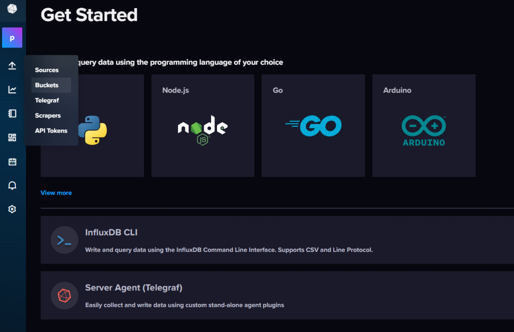

- Click on your bucket name and you should be greeted with the following page.

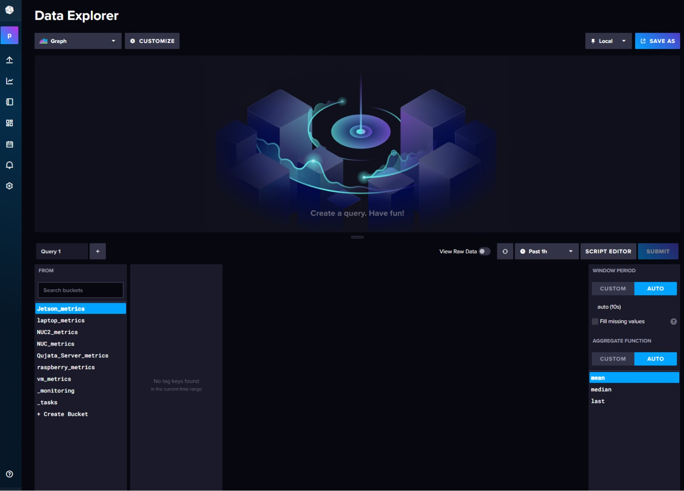

- Click on the bucket name and then click on one of the values in the _measurement filter, and
keep clicking on other values as and when they appear.

- Once you are done, click the Submit button. You should see a graph at the top. You might need to wait for some time for the data to appear.

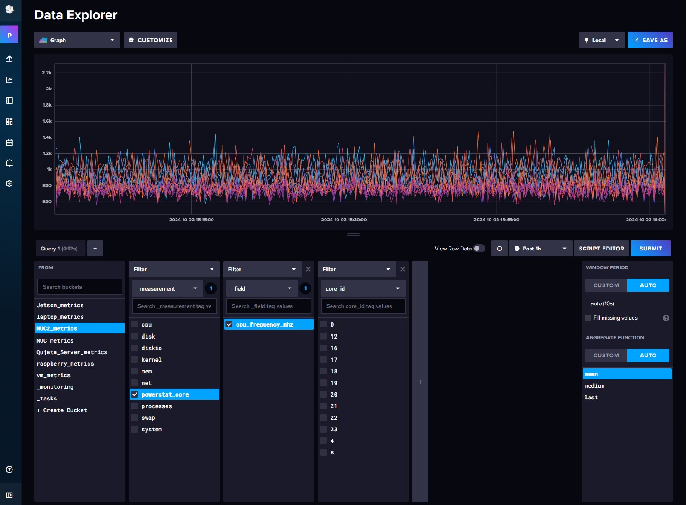

This should confirm that the data is being passed on correctly.

### Step 3: Install Grafana Using Docker

**Run Grafana Docker Container:**
According to the current implementation grafana instance is installed and configure in a separate virtual machine.

To use Docker volumes for persistent storage you must create a docker volume to be used by the Grafana container, giving it a descriptive name (e.g. grafana-storage). Run the following command:

```bash
sudo docker volume create grafana-storage
```
Make sure to copy “docker-compose.yaml” file in the directory where the following command will be executed. Start the Grafana docker container by running the following:

```bash
sudo docker run -d -p 3000:3000 --name=grafana --volume grafana-storage:/var/lib/grafana -e GF_DASHBOARDS_MIN_REFRESH_INTERVAL=300ms grafana/grafana-enterprise
```

### Step 4: Configure Grafana Data Source

Launch the Grafana UI at http://<serverIP>:3000 in your browser and the following Grafana login page should greet you.

  1. Log in with the default credentials (admin / admin), and set new username and password.

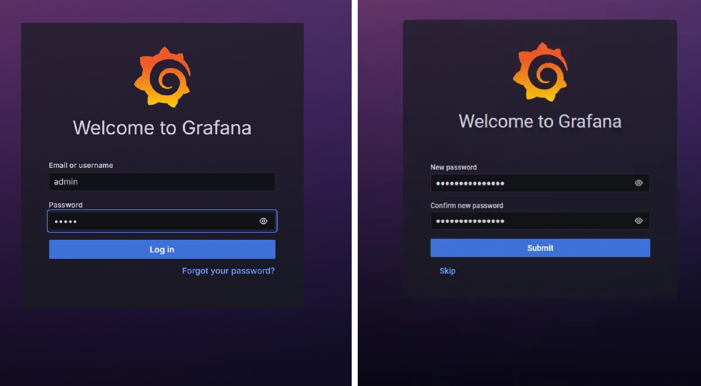
  
  2. Click on the Add your first data source button. Follow the next steps and create a data source for both your physical machines.

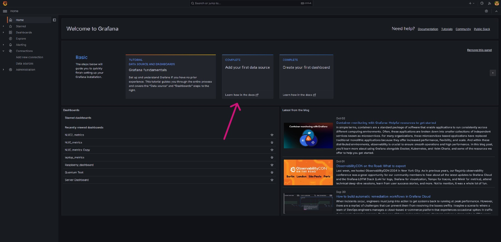

  3. Choose “Connections → Data sources” on the side menu and click the “+ Add new data source” button.

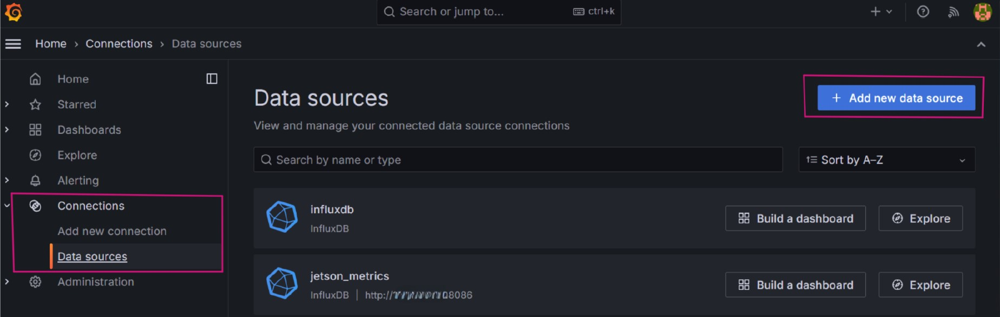

  4. Click the InfluxDB button.

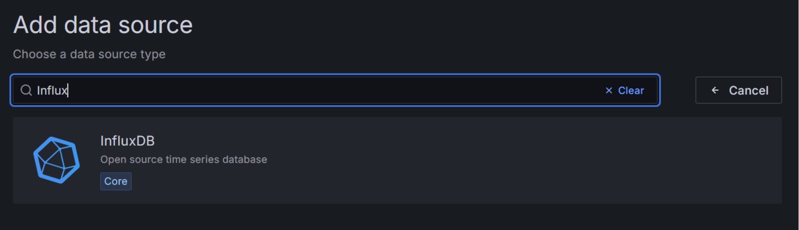

  5. On the next page, select “Flux” from the dropdown menu as the query language. Flux supports InfluxDB v2.x and is easier to set up and configure. Enter the following values:

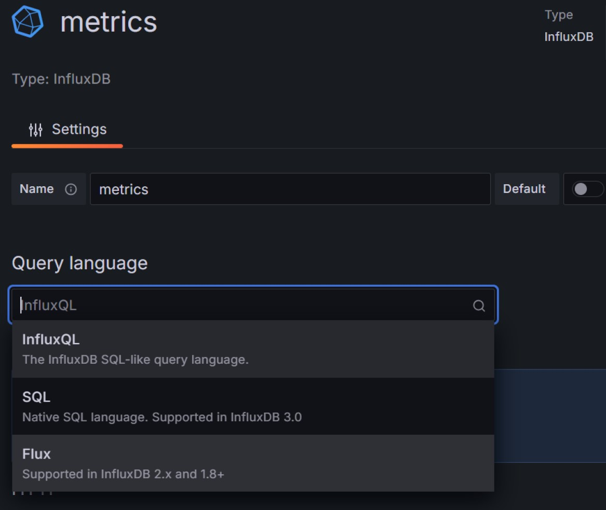


  6. Enter the following values (example image below):

**HTTP:**
```plaintext
URL: 'http://<Influxdb_IP_Address>:8087'
```

**Auth:**

```plaintext
User: <Your_UserName>
Password: <Your_Influxdb_Password>
```

**InlfuxDB Details:**

```plaintext
Organization: pqreact
Token: <Influxdb_Token>
Bucket: metrics
Min time interval: 300ms
Max series: 10000
```


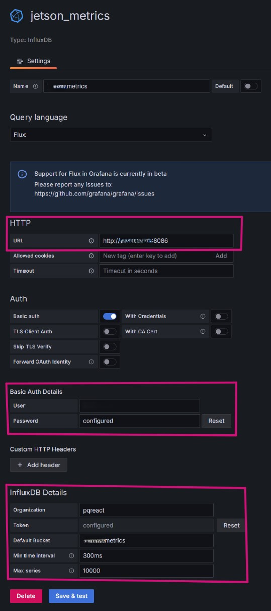

  7. Click the `Save and Test` button to verify the setup. The next message should be displayed.

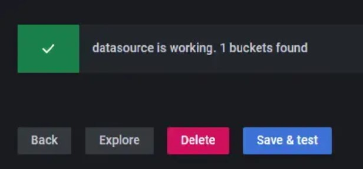

### Step 5: Set up Grafana Dashboards

The next step is to set up Grafana Dashboard.

  1. Click on the sign with the four squares and select “Dashboards” to open the “Import” dashboard screen. Follow the next steps and create a dashboard for each of your physical machines.

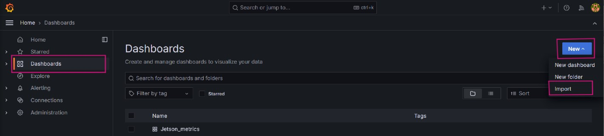

  2. From the `Import dashboard` load the provided .json file which contains the dedicated dashboard setup.

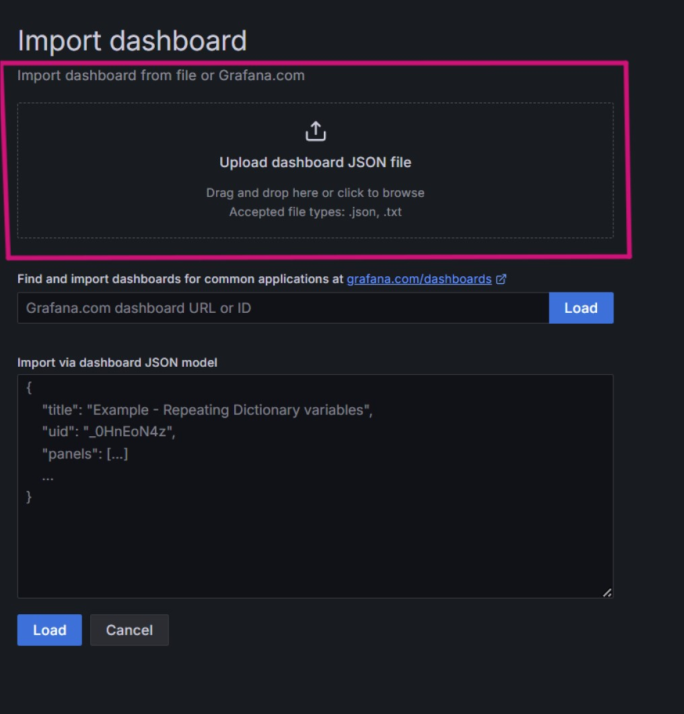

### Important Note
- If grafana doesn't let you upload .json file then you should copy and paste the content of `metrics_dashboard-1728313377372.json` file in the `Import  via dashboard JSON model` frame and then press load.
- In the provided .json file it is assumed that the username is `node-1`, the network interface is `enp86s0` and the name of the bucket is `metrics`. If otherwise please change
those values in the entire .json file with the ones that match your setup.

3. In the `Dashboards` menu select the name of the imported dashboard.

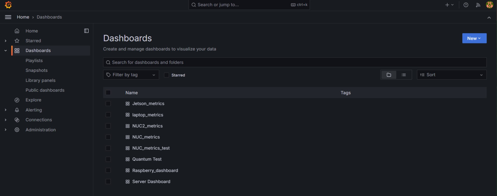

You may see that every panel displays “No data”. In that case commit the following changes in order to enable the “No data” panels:

- Hover your mouse over a panel and click the right top button with the three vertical dots to expand the drop down menu and select `edit`

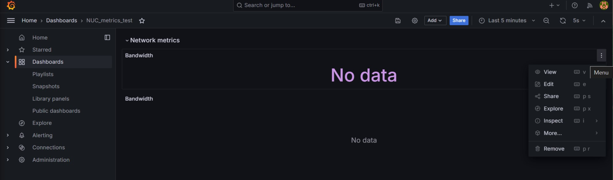

- Make sure that in `Data source` field is selected the name of your bucket (in this case “metrics”), and in the flux language code you see the correct name of your bucket, username, network interface:
  
```plaintext
from(bucket: "metrics")
  |> range(start: v.timeRangeStart, stop: v.timeRangeStop)
  |> filter(fn: (r) => r["_measurement"] == "net")
  |> filter(fn: (r) => r["_field"] == "bytes_recv" or r["_field"] == "bytes_sent")
  |> filter(fn: (r) => r["host"] == "node-1")
  |> filter(fn: (r) => r["interface"] == "enp86s0")
  |> aggregate.rate(every: 1s, unit: 1s)
  |> yield(name: "mean")
```

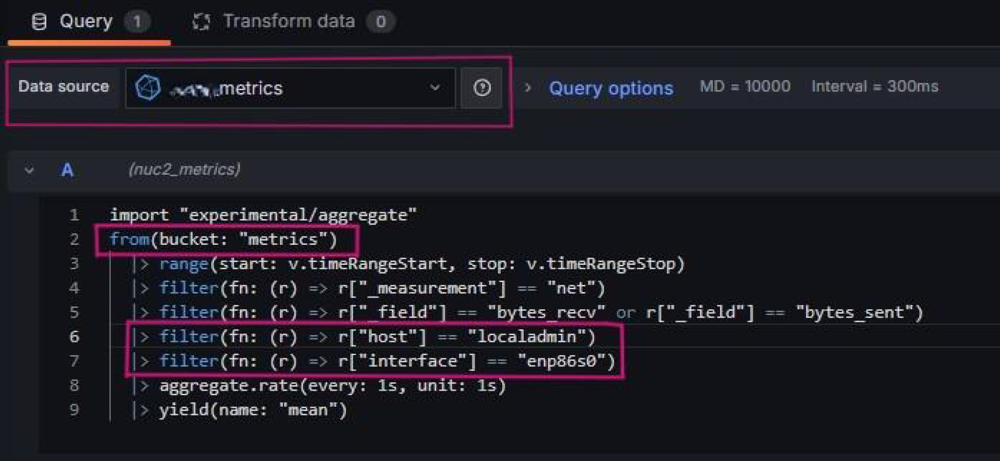

- Then click the “Query inspector” button and on the side menu that will appear click the “refresh” button. You should now see your metrics displayed. Exit the side menu and click “Apply” on the top right area.

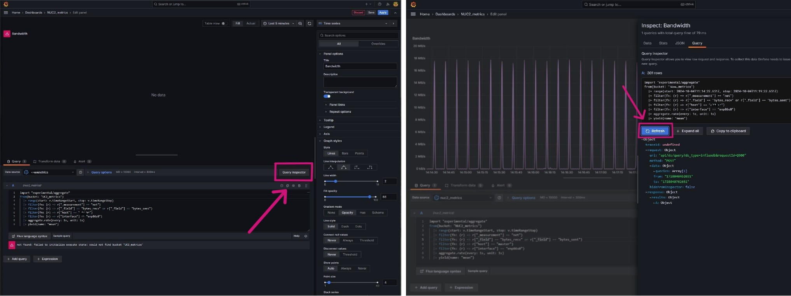

- Repeat the steps above to every panel that displays “no data”

- Set the refresh rate to `300ms` to enable fast panel data updates.

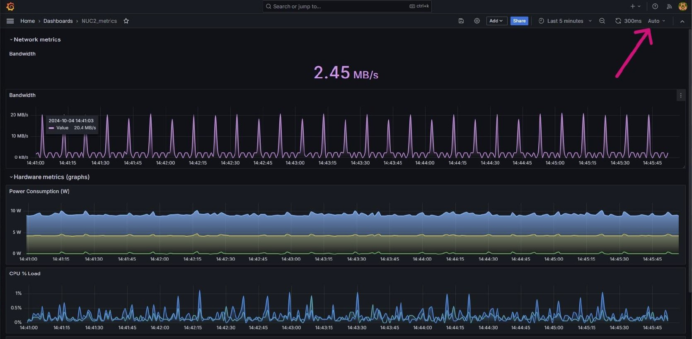

### Step 6: Qujata Testbed Installation and Configuration

In this part of the guide we will configure and use Qujata testbed in two different machines to evaluate the performance of the supported Quantum-Safe Crypto protocols and encryption algorithms between Server/Client communication.

Download the Qujata GitHub Repository in Both Machines:

```bash
git clone https://github.com/att/qujata.git
```

**Set Up Qujata Server:**

Navigate to the qujata/run/docker directory and start the server:

```bash
sudo docker compose up
```

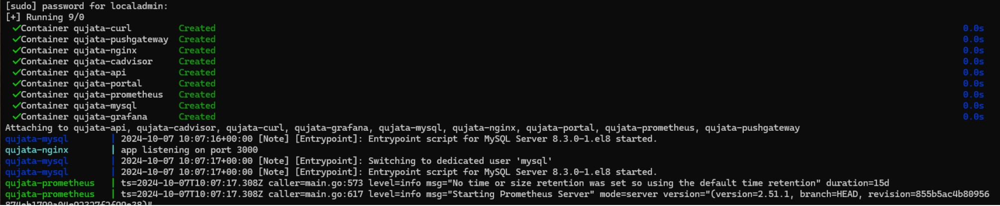
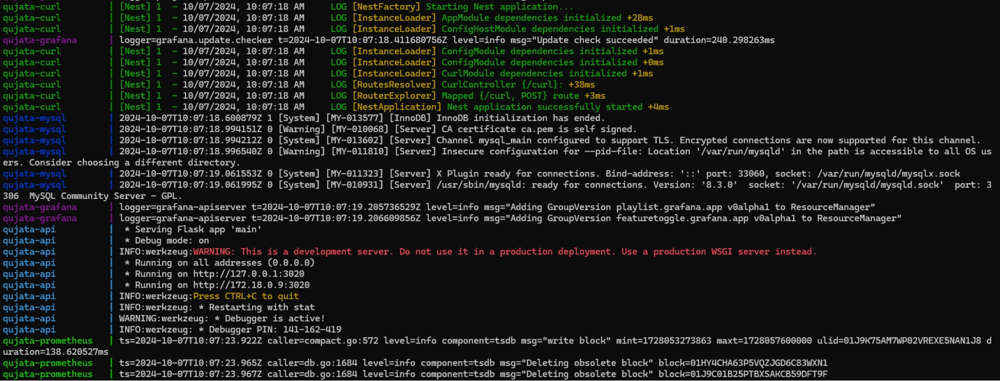

**Set Up Qujata Client:**

In the second machine start a client instance. It is required that Node.js (includes npm) is already installed in your system.

Navigate to the "qujata/curl" directory, install the required dependencies and start the Post Quantum Cryptography tool running the following command:

```bash
npm install
npm run start
```

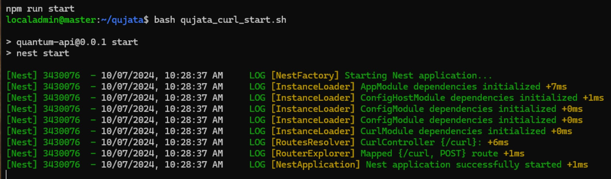

**Modify and Run Python Test Script:**

Open a new terminal and edit the script performance_test.py to assign the Server IP to the “url” variable:

```bash
nano performance_test.py
```

```python
import requests
import json
import time
# List of algorithms
algorithms = [
"bikel1",
"bikel3",
"bikel5",
"frodo1344aes",
"frodo1344shake",
"frodo640aes",
"frodo640shake",
"frodo976aes",
"frodo976shake",
"hqc128",
"hqc192",
"hqc256",
"kyber1024",
"kyber512",
"kyber768",
"p256_kyber512",
"p384_kyber768",
"prime256v1",
"secp384r1",
"x25519_kyber768"
]
# API endpoint — supply via env var: CAM_QUJATA_URL=http://<host>:3010/curl
url = os.environ['CAM_QUJATA_URL']
```
You can also change the number of iterations and the size of the encrypted message that will be sent to the server if you edit the following lines of the snippet (“interationsCount”:500 and “messageSize”:1000 are the default values) Run the script to test the post-quantum and hybrid algorithms:

```python
# Payload data
data = {
"algorithm": "",
"iterationsCount": 500,
"messageSize": 1000 # You can change this value based on
the API requirements
}
```

```bash
python3 performance_test.py
```

### Step 7: Test Server/Client communication with Qujata testbed

You can test Post-Quantum and Hybrid algorithms by executing python snippet

```bash
python3 performance_test.py
```
Client terminal will log the name of the algorithm used and the total size of the message sent.

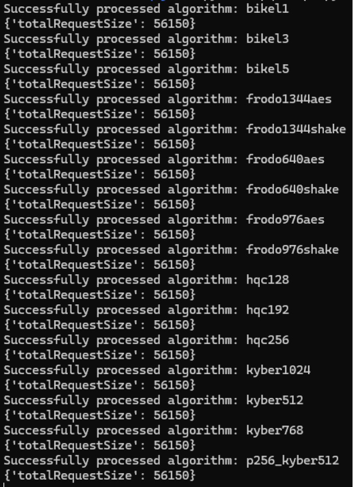

Server terminal will log the following requests:

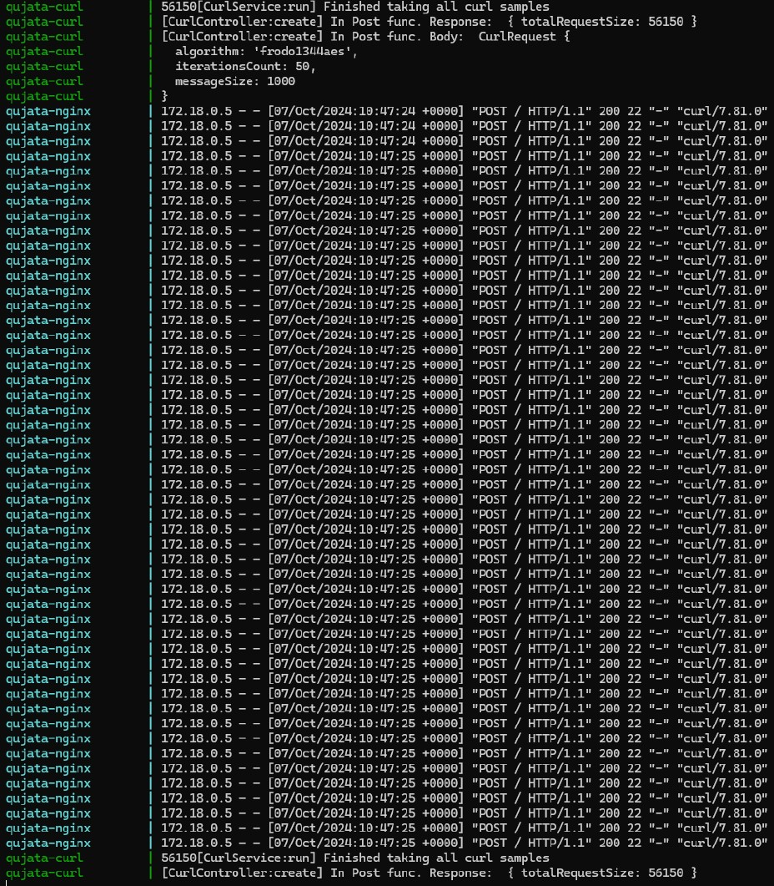

Finally the dashboard of Server and client machines should display fluctuations of the different metrics as a result of the testing of Qujata testbed.

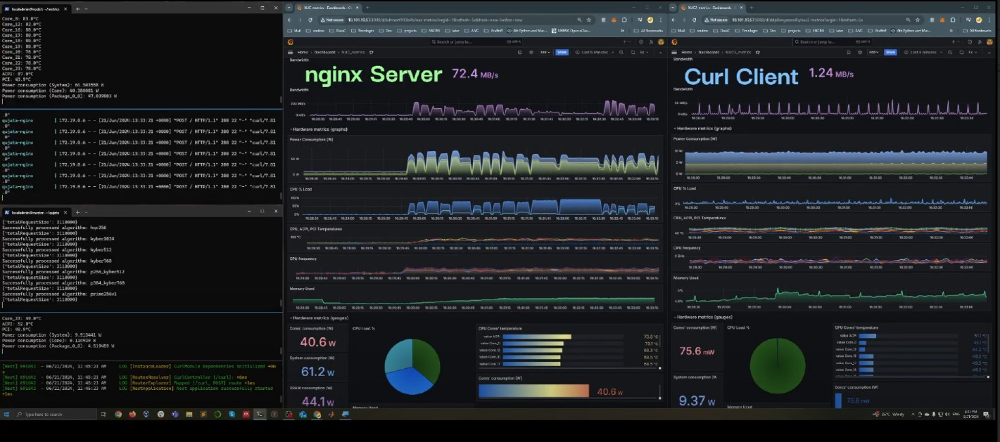

---

## Optional: PQ-REACT MCP bridge (`pqreact_hooks/`)

CAM is **standalone-by-default**: the steps above run end-to-end against just InfluxDB + Grafana + a Qujata testbed, with no other services required.

The `pqreact_hooks/` subdirectory adds an **optional bridge** to the wider PQ-REACT testbed (the patched `core-ncsrd/PQ-REACT_MCP-Server` MCP server + LLM chat UI, deployed by `KatanaSliceManagerv2`):

- **`mcp_hook.py`** — sweeps Qujata, then UPSERTs one row per algorithm into the PQ-REACT MariaDB tagged `source='cam-context-agility'`. CAM measurements appear next to other PQ-REACT data sources in the same table.
- **`chat_advisor.py`** — POSTs natural-language questions ("recommend an algorithm for IoT", "rank by energy at L3") to the LLM chat at `http://<gpu-vm>:8081`. The agent runs SQL against `performance_test WHERE source='cam-context-agility'` and returns `ALG=<name>` plus a one-sentence rationale.
- **`cam_runner.py`** — agility loop: wide sweep → store → LLM recommend → narrow re-sweep.

Everything in `pqreact_hooks/` is opt-in. You can ignore the directory entirely if you don't have a PQ-REACT MCP deployment to point at. To enable it:

```bash
cd pqreact_hooks
cp .env.example .env
# edit .env: set MCP_DB_PASSWORD and any IPs that differ from defaults
pip install -r requirements.txt
set -a; . ./.env; set +a
python3 mcp_hook.py
```

See `pqreact_hooks/README.md` for the full bridge documentation.


